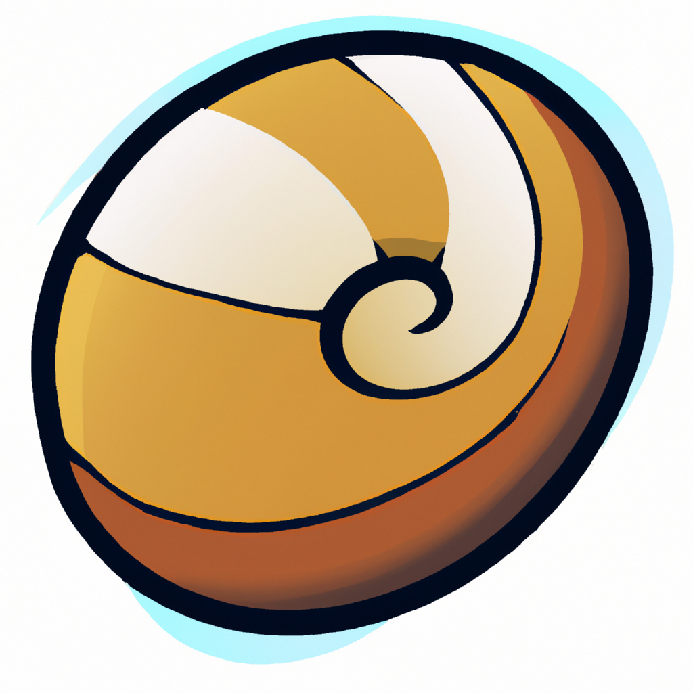

# WebShell

<p align="center">
  <a href="https://github.com/0xfeedface1993/WebShell"></a>
</p>

<p align="center">
  <a href="https://github.com/0xfeedface1993/WebShell"></a>
  <a href="https://github.com/Carthage/Carthage"></a>
<a href="https://github.com/0xfeedface1993/WebShell/issues"></a>
</p></p>

<br>

Better way write worm code with Swift.

### Ussage

```swift
 cancellable = DownPage()
    .join(PHPLinks())
    .join(Saver(.override))
    .publisher(for: link)
    .sink { complete in
        switch complete {
           case .finished:
               break
           case .failure(let error):
               print(">>> download error \(error)")
        }
    } receiveValue: { url in
        print(">>> download file at \(url)")
    }
```

The file will download at your `Downloads` folder.

## Installation

#### carthage
[Carthage](https://github.com/Carthage/Carthage) is a simple, decentralized dependency manager for Cocoa.

Specify WebShell into your project's `Cartfile`:

```ogdl
github "0xfeedface1993/WebShell" ~> 3.0
```

##
As you can see, this project need more work, so if you want join me, any pull request will be helpful!

## Thanks! Have a good day!
